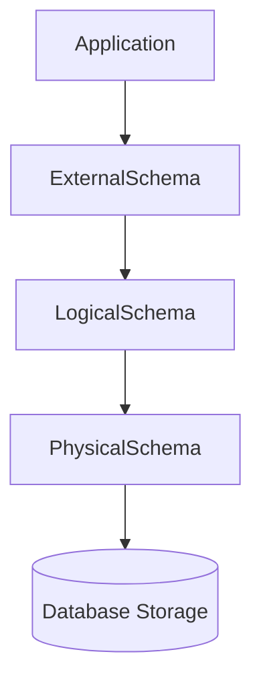

### Relational Model
defines a database abstraction based on relations between data to reduce the maintaince overhead
Key tenets:
1. Store data in simple structures ( relations )
2. Physical Storage is left up to the DBMS implementation
3. Access data through high level language, DBMS figures out the best strategy

### Components of Relational Model
1. **Structure**: The definition of database's relation and their contents independent of the underlying storage structure
2. **Integrity**: Ensure the database constraints satisfy
3. **Manipulation**: Programming interface to update data



## Relational Model

| name         | year | country |
| ------------ | ---- | ------- |
| Wu Tang      | 1992 | USA     |
| Notorius Big | 1992 | USA     |
| GZA          | 1990 | USA     |

**Relation** - unordered set that contain the relationship of attributes that represent entities
**Tuple** - set of attribute values ( domain ) in the relation
	Values are normally atomic scalar
	 Special value null is a member of every domain (if allowed)


### Primary Keys
Primary key uniquely identifies a single tuple. Can be some set of attributes that uniquely represent one entity within our relation. Also in case of some systems if we don't define a primary key, those systems will create one for us.

We can't use name of the artist as name of artist can be same

**ARTIST TABLE**

| id  | name         | year | country |
| --- | ------------ | ---- | ------- |
| 101 | Wu Tang      | 1992 | USA     |
| 102 | Notorius Big | 1992 | USA     |
| 103 | GZA          | 1990 | USA     |

So these id's don't map to any attribute in real world but they help us to identify our item in the DB, where our data is located 
DBMS can auto-generation unique primary keys via an *identity column*
	**IDENTITY** (SQL Standard)
	 **SEQUENCE** (Postgres)
	 **AUTO_INCREMENT** (My sql)

### Foreign Keys
Specifies that an attribute from one relation maps to a tuple in other relation

**ALBUM TABLE**

| id  | name              | year |
| --- | ----------------- | ---- |
| 11  | Enter the Wu tang | 1993 |
| 22  | St. Mdex          | 1992 |
| 33  | Liquid Sword      | 1991 |

**ARTISTALBUM TABLE**
artist_id is reference from Artist table and album_id is referenced from Album table

| artist_id | album_id |
| --------- | -------- |
| 101       | 11       |
| 101       | 22       |
| 103       | 22       |
| 102       | 22       |

### Constraints
User defined conditions that must hold for any instance of the database
1. Can validate data within a single tuple or across entire relation(s).
2. DBMS prevents modifications that violate any constraint.

Unique key and refrential(fkey) constraints are the most common

```
CREATE TABLE ARTIST(
	name VARCHAR NOT NULL,
	year INT,
	country CHAR(60),
	CHECK (year > 1900)
)
```

NOT NULL , CHECK (year > 1900) both are constraints

### DML
The API that DBMS exposes to application to store and retrieve info from a Database
**Procedural**: Query specifies (high level) strategy to find the desired result based on sets/bags. This is relational Algebra
**Non-Procedural**: Query specifies only what data is wanted and not how to find it. This is relational Calculus

### RELATIONAL ALGEBRA
1. Fundamental operations to retrieve and manipulate tuples in a relation
	1. This is based on set algebra ( unordered lists with no duplicates )
2. Each Operator takes one or more relations as its input and outputs a new relation
	1. We can chain operators together to create more complex operations

|          | Operations   |
| -------- | ------------ |
| $\sigma$ | Select       |
| $\cup$   | Union        |
| $\pi$    | Projection   |
| $\cap$   | Intersection |
| $-$      | Difference   |
| $X$      | Product      |
| $\infty$ | Join         |

#### Select
Here is the set of tuple I wants for a given relation. Choose a subset of tuples from a relation that satisfies  a selection predicate
1. Predicate acts as a filter to retain only tuples that fulfill it's qualifying requirement
2. Can combine multiple predicates using conjunction/disjunctions
**Syntax** - $\sigma_{predicate}(R)$

predicate could be ``year = 1992`` or ``year = 1992 and name = 'St. Medex'``
This predicate is simple just a `where` clause

#### Projection
Generate a relation with tuples that contains only the specified attributes.
1. Rearrange attributes ordering
2. Remove unwanted attributes
3. Manipulate values to create derived attributes
4. Arithmetic operations and string manipulations as well
**Syntax** - $\pi_{A_{1},A_{2},..,An}(R)$

*R(a_id,b_id)*

| a_id | b_id |
| ---- | ---- |
| a1   | 101  |
| a2   | 102  |
| a2   | 103  |
| a3   | 104  |

$\pi_{b\_id-100,a\_id}(\sigma_{a\_id='a_{2}'}(R))$

| b_id-100 | a_id |
| -------- | ---- |
| 2        | a2   |
| 3        | a2   |

#### Union
Generate a relation that contains all tuples that is present in either only one or both inputs
This operator only works if both the relations we are trying to union have the same attributes with the same types
**Syntax**: $(R \cup S)$

**R(a_id, b_id)** 

| a_id | b_id |
| ---- | ---- |
| a1   | 101  |
| a2   | 102  |
| a3   | 103  |
|      |      |
**S(a_id, b_id)**

| a_id | b_id |
| ---- | ---- |
| a3   | 103  |
| a4   | 104  |
| a5   | 105  |
|      |      |
**(R U S)**

| a_id | b_id |
| ---- | ---- |
| a1   | 101  |
| a2   | 102  |
| a3   | 103  |
| a4   | 104  |
| a5   | 105  |
``(Select * from R) UNION ALL (Select * from S)`` will keep duplicates
``(Select * from R) UNION (Select * from S)`` will remove duplicates

#### Intersection
Generate a relation that contains only the tuples that appear in both of the input relations. This operation also works only if the columns are same
**Syntax**: $(R \cap S)$

**R(a_id, b_id)** 

| a_id | b_id |
| ---- | ---- |
| a1   | 101  |
| a2   | 102  |
| a3   | 103  |
|      |      |
**S(a_id, b_id)**

| a_id | b_id |
| ---- | ---- |
| a3   | 103  |
| a4   | 104  |
| a5   | 105  |
|      |      |
**$(R \cap S)$

| a_id | b_id |
| ---- | ---- |
| a3   | 103  |
|      |      |
``(Select * from R) INTERSECT (Select * from U)``

#### Difference
Generate a relation that contains only tuples that appear in first relation but not in the second. This operation only works if columns are same
**Syntax** $R - S$ 

**R(a_id, b_id)** 

| a_id | b_id |
| ---- | ---- |
| a1   | 101  |
| a2   | 102  |
| a3   | 103  |
|      |      |
**S(a_id, b_id)**

| a_id | b_id |
| ---- | ---- |
| a3   | 103  |
| a4   | 104  |
| a5   | 105  |
|      |      |
**$(R - S)$

| a_id | b_id |
| ---- | ---- |
| a1   | 101  |
| a2   | 102  |
|      |      |
``(Select * from R) EXCEPT (Select * from S)``

#### PRODUCT
Generate a relation that contains all possible combination of tuples from the input relation. No need for columns to be same at all.
**Syntax**: $(R * S)$

**R(a_id, b_id)** 

| a_id | b_id |
| ---- | ---- |
| a1   | 101  |
| a2   | 102  |
| a3   | 103  |
|      |      |
**S(a_id, b_id)**

| a_id | b_id |
| ---- | ---- |
| a3   | 103  |
| a4   | 104  |
| a5   | 105  |
|      |      |
**$(R * S)$

| R.a_id | R.b_id | S.a_id | S.b_id |
| ------ | ------ | ------ | ------ |
| a1     | 101    | a3     | 103    |
| a1     | 101    | a4     | 104    |
| a1     | 101    | a5     | 105    |
| a2     | 102    | a3     | 103    |
| a2     | 102    | a4     | 104    |
| a2     | 102    | a5     | 105    |
| a3     | 103    | a3     | 103    |
| a3     | 103    | a4     | 104    |
| a3     | 103    | a5     | 105    |
``Select * from R CROSS JOIN S``

#### JOIN
Generate a relation that contains all tuples that are combination of two tuple(one from each input relation) with a common value(s) for one or more attributes
**Syntax**: $R \infty S$

**R(a_id, b_id)** 

| a_id | b_id |
| ---- | ---- |
| a1   | 101  |
| a2   | 102  |
| a3   | 103  |
|      |      |
**S(a_id, b_id,val)**

| a_id | b_id | val |
| ---- | ---- | --- |
| a3   | 103  | XXX |
| a4   | 104  | YYY |
| a5   | 105  | ZZZ |
|      |      |     |
**$(R \infty S)$

| a_id | b_id | val |
| ---- | ---- | --- |
| a3   | 103  | XXX |
|      |      |     |

``Select * from R JOIN S ON R.a_id = S.a_id AND R.b_id = S.b_id``

